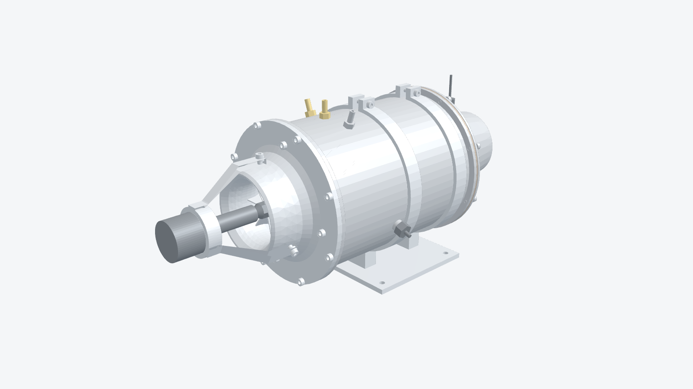
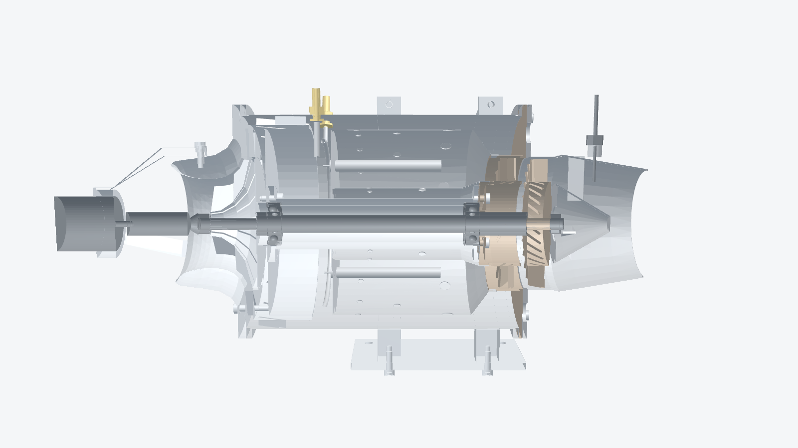

# RC micro-turbine: parametric CAD model

A complete, editable CAD model of a small hobby turbojet in the proven **KJ-66 class**: 66 mm centrifugal compressor, annular vaporizer-stick combustor, 66 mm axial turbine, 110 mm casing. It includes every part an engine of this type needs to run, plus the mounting, fasteners, fuel/gas/lube plumbing, ignition, temperature sensing and starter.




> **Read this first.** This is a design starting point, not a certified or test-run engine. The layout, proportions and hole patterns follow the proven hobby layout, but this specific geometry has **not been run**. The compressor wheel, turbine wheel and starter motor are **envelopes** for parts you buy, and their real dimensions must be measured and entered before anything is machined. A micro turbine spins at over 100,000 rpm with a turbine running near 700 °C. A wheel failure is a shrapnel event. See [Safety](#safety).

## What's in this folder

| Path | What it is |
|---|---|
| `fusion/RCTurbine/` | **Native Fusion script.** Builds the whole engine as a parametric Fusion design, with a timeline, components, user parameters and materials. |
| `fusion/RCTurbine/turbine_geometry.py` | **The one place every dimension lives** (`PARAMS`). Both the Fusion script and the STEP build read it, so they always match. |
| `cad/rc_turbine.py` | CadQuery build that exports STEP/STL and checks solid validity and interference. |
| `cad/out/rc_turbine_assembly.step` | Full assembly: 31 parts plus 35 fasteners, each a named component with colour. |
| `cad/out/parts/*.step` | One STEP per part, for CAM, drawings or editing one part at a time. |
| `cad/out/stl/*.stl` | Meshes for 3D-printed fit-check mockups. **Do not run printed parts.** |
| `cad/out/mass_report.csv` | Estimated mass of every part. |
| `fusion/tests/` | Offline test of the Fusion script's logic (see below). |
| `docs/` | Renders. |

## Option A: build it natively in Fusion (recommended)

1. Copy or keep the whole `fusion/RCTurbine` folder. The script needs `turbine_geometry.py` next to it.
2. In Fusion: **Utilities → Add-Ins → Scripts and Add-Ins**. On the **Scripts** tab, click the green **+** and choose the `RCTurbine` folder.
3. Select **RCTurbine** and click **Run**. It opens a new design and builds every part, with a progress bar. Expect a minute or two.
4. You get:
   - one component per part (`01 Intake cover` … `20 Mount plate`, plus `Fasteners`);
   - a real timeline of sketches, revolves, extrudes, circular patterns and construction planes;
   - physical materials, so Fusion's mass properties work;
   - reused components for identical parts: one bearing used twice, one fitting used three times, one screw per size placed 35 times. Editing one updates every copy.

**Live parameters.** In **Modify → Change Parameters**, these user parameters drive the model directly, and the timeline recomputes when you change them:

| Parameter | Drives |
|---|---|
| `n_axial_vanes`, `n_radial_vanes`, `n_ngv`, `n_turb_blades`, `n_comp_blades`, `n_sticks`, `n_flange_screws` | Pattern counts |
| `ngv_angle`, `turb_blade_angle`, `diff_vane_angle` | Vane and blade angles (tilted construction planes) |
| `m3_clear`, `m3_tap`, `mount_hole_d` | Hole diameters (sketch dimensions) |
| `stick_d`, `stick_len` | Vaporizer stick tube size |
| `mount_plate_t` | Mount plate thickness |

The other parameters (wheel diameters, casing, bearing sizes and so on) are listed for reference. The revolve profiles are generated from them when the script runs. To change them, edit `PARAMS` in `turbine_geometry.py` and run the script again to get a fresh design. Profiles are ordinary sketches, so you can also edit them by hand in the timeline.

A few counts are tied together. The diffuser screw holes go through every third radial vane, so keep `n_radial_vanes` a multiple of 4. The nozzle lightening holes follow `n_flange_screws`.

## Option B: import the STEP

**File → Open → Open from my computer…** and pick `cad/out/rc_turbine_assembly.step`. Each part arrives as a component. Edit with direct modelling (Press Pull, Move); new features you add after the import are parametric.

## Rebuilding the STEP files

```bash
pip install cadquery               # once
cd cad
python rc_turbine.py --check       # rebuilds every STEP/STL, checks validity and interference
python ../fusion/tests/test_rcturbine_logic.py   # checks the Fusion script's logic without Fusion
```

The Fusion test runs the script against a stand-in for the Fusion API that computes real construction-plane geometry. It checks that every part builds and every sketch point lies on its sketch plane, under all four possible axis-orientation conventions. It can't check Fusion's own modelling kernel. If a feature fails inside real Fusion, the script finishes the remaining parts and lists the failed ones in its closing message.

Axes: engine axis **+Z**, fittings on top (**+Y**), intake front at z ≈ −4 mm.

## Engine layout (front to back)

| # | Part | Material / process | What it does |
|---|---|---|---|
| 01 | Intake cover | 6082-T6 aluminium, CNC turned | Bellmouth and compressor shroud contour (0.3 mm tip clearance). Carries the starter bracket; bolts to the casing flange and the diffuser. |
| 02 | Compressor wheel | **Buy**: 66 mm hobby compressor wheel | Envelope only. |
| 03 | Diffuser | 6082-T6, 5-axis or 3-axis + indexing | 12 wedge radial vanes (4 carry the M3 screws from the intake), then 20 axial de-swirl vanes into the casing annulus. |
| 04 | Bearing tunnel | 6082-T6 or 7075-T6, turned | Two Ø22 bearing bores, front flange to diffuser, rear flange to NGV. Lube port feeds the fuel/oil mix. |
| 05 | Shaft | 17-4PH H900 or hardened tool steel, ground | Ø8 bearing seats, Ø9 centre with locating shoulders, M6 ends for the wheels. |
| 06 | Bearings (×2) | **Buy**: 608-size (8×22×7) hybrid ceramic, high-speed cage | Rear bearing floats with wave-spring preload. |
| 07 | Sleeves + wave spring | Steel, ground faces | Clamp the rotor stack. |
| 08 | Combustor | 0.5 mm 1.4828 / 310 stainless, rolled and TIG welded | Annular liner, 6 vaporizer sticks, primary, secondary and dilution holes, glow plug port. |
| 09 | NGV | Inconel 625 (fabricated) or buy a cast NGV | 19 vanes. Its outer flange also closes the air annulus. |
| 10 | Turbine wheel | **Buy**: 66 mm cast Inconel 713LC | Envelope only. |
| 11 | Casing | 0.6 mm stainless tube with welded flange rings | Tapped M3 flanges front and rear, fitting holes, glow plug boss. |
| 12 | Nozzle | 0.8 mm stainless spun, tail cone on 3 struts | Ø54 exit; thermocouple boss. |
| 13 | Nuts | Steel, compressor nut with starter cone | Compressor nut can carry the RPM magnet. |
| 14 | Fuel manifold, gas ring, lube line | 3 mm / 2.5 mm stainless tube, Ø1 needles | Fuel to each stick, propane ring for start-up, bearing lubrication. |
| 15 | Fittings (×3) | **Buy**: M5 bulkhead barbs | Fuel, gas, lube. |
| 16 | Glow plug | **Buy**: turbine glow plug | Ignites start gas. |
| 17 | Thermocouple | **Buy**: K-type, Ø1.5 mm probe | Exhaust gas temperature (EGT) for the ECU. |
| 18 | Starter bracket, cone, motor | Aluminium bracket, rubber cone, **buy** brushless motor | Spins the rotor to light-off speed through the compressor nut. |
| 19–20 | Mount bands + base plate | 6061-T6 | Split clamp bands, 4 × Ø4.5 airframe holes. |

Estimated mass is about 2.1 kg including the mount, starter and fittings (see `mass_report.csv`). That is heavier than commercial engines of this class (about 1.1–1.4 kg), because the wheel envelopes are solid and the walls are conservative. Thin the intake, diffuser and NGV flange once the design is proven.

## Bill of materials

### Purchased parts
| Qty | Item | Notes |
|---|---|---|
| 1 | Compressor wheel, 66 mm, 6 mm bore | Enter measured inducer/exducer diameters, blade height and length in `PARAMS`. |
| 1 | Turbine wheel, 66 mm, cast Inconel 713LC, 6 mm bore | Must match the NGV. |
| 2 | 608 hybrid ceramic bearings (8×22×7) | High-speed rated, ceramic balls, polymer or brass cage. |
| 1 | Wave spring, 22 mm OD | Rear bearing preload. |
| 1 | Turbine ECU with EGT, RPM and glow outputs | Controls start sequence, fuel pump and valves, and enforces limits. |
| 1 | Turbine fuel pump (brushless or brushed) + filter | Kerosene with about 5% turbine oil. |
| 2–3 | Solenoid valves | Fuel, start gas, and optionally lube. |
| 1 | Start-gas tank + regulator | Propane/butane mix. |
| 1 | Brushless starter motor, about 28 mm can, + rubber clutch cone | |
| 1 | Turbine glow plug | |
| 1 | K-type thermocouple, Ø1.5 mm, with compression fitting | |
| 1 | RPM sensor: magnet in the compressor nut plus a Hall sensor, or optical | |
| 3 | M5 bulkhead barb fittings | |
| — | PTFE/Festo fuel line, 4 mm | |

### Fasteners (all ISO 4762 socket head cap screws)
| Qty | Size | Where | Notes |
|---|---|---|---|
| 8 | M3×8 | Intake → casing front flange | A2 stainless |
| 4 | M3×10 | Intake → diffuser vanes | A2 |
| 4 | M3×8 | Tunnel → diffuser | A2 + thread locker |
| 4 | M3×6 | NGV hub → tunnel | Hot. Heat-resistant (A286 / Inconel) |
| 8 | M3×8 | Nozzle + NGV flange → casing rear flange | Hot. Heat-resistant, anti-seize |
| 3 | M3×8 | Starter bracket → intake | A2 |
| 2 | M3×16 | Mount band clamps | A2 |
| 2 | M3×10 | Mount bands → base plate | A2 |
| 1 | M6 nut | Turbine wheel | Heat-resistant; secure with high-temperature thread locker or a tab washer |

## Critical tolerances

These decide whether the engine survives, not just whether it runs.

- **Bearing bores:** both Ø22 bores coaxial within 0.01 mm. Finish them in one setup.
- **Shaft:** bearing seats and wheel seats concentric within 0.005 mm runout. Grind between centres.
- **Rotor balance:** balance the compressor wheel, turbine wheel and shaft assembly dynamically, to G1.0 or better. An unbalanced 66 mm wheel at 100k+ rpm destroys its bearings within seconds.
- **Tip clearance:** 0.2–0.3 mm at the compressor shroud and turbine shroud (`tip_clearance`).
- **NGV throat area:** the main matching parameter between compressor and turbine. Set the vane angle and count for your turbine wheel. The model uses 58° and 19 vanes as a starting point.
- **Axial float:** set the wheel-to-shroud axial gaps with shims after measuring the purchased wheels.

## Assembly order

1. Press the bearings into the tunnel, with the wave spring behind the rear bearing. Fit the shaft with the inner-race shoulders, then the front and rear sleeves.
2. Bolt the tunnel to the diffuser (4 × M3×8).
3. Fit the balanced compressor wheel and compressor nut. Check free rotation and shroud clearance against the intake cover.
4. Bolt the intake cover to the diffuser (4 × M3×10 through the thick radial vanes).
5. Slide the combustor over the tunnel and fit the fuel manifold needles into the stick mouths. Fit the gas ring and lube line.
6. Bolt the NGV hub to the tunnel rear flange (4 × M3×6). Seat the liner ends on the NGV hub and outer ring.
7. Fit the balanced turbine wheel and nut. Check turbine tip clearance.
8. Slide the casing on and screw it to the intake flange (8 × M3×8). Fit the fittings, glow plug and internal line connections.
9. Fit the nozzle: 8 × M3×8 through the nozzle and NGV flange into the casing rear flange. Fit the thermocouple.
10. Fit the starter bracket, motor and cone, the mount bands and the base plate.

## First run

Follow your ECU's procedure. The usual sequence is:

1. Glow plug on, gas valve opens, and the starter spins the rotor to about 5–8k rpm.
2. Light-off on gas is confirmed by an EGT rise.
3. Kerosene fades in as gas fades out, and the ECU accelerates to idle, typically 30–40k rpm for this class.
4. Hold at idle and watch EGT, vibration and rpm stability before any throttle-up.

Engines of this class typically make 60–80 N at 110–120k rpm with 600–700 °C EGT. These are **class figures, not predictions for this geometry**, so set your ECU limits conservatively for the first runs.

## Safety

- Run only on a rigid test stand, **outdoors**, with a burst guard around the turbine plane. Never stand in line with the rotating parts.
- Have a CO₂ extinguisher ready. Wear eye and hearing protection. Keep the intake clear of loose objects.
- Never run a printed part, an unbalanced rotor, or an unknown wheel.
- Model-turbine flying is regulated. In the US, for example, the AMA requires a turbine waiver. Check your local rules before flying.

## Known limits of this model

- This is a subsonic model-aircraft engine. Engines of this class push model jets to roughly 0.4–0.6 Mach, and the design is not intended or suitable for supersonic flight.

- The wheel geometry is a placeholder. Blade shapes come from the parts you buy.
- No CFD or FEA has been run. The combustor hole pattern and NGV angle follow typical hobby practice and will need tuning on the stand.
- Threads are shown as tap-drill and clearance holes. Model cosmetic threads in Fusion before making drawings.
